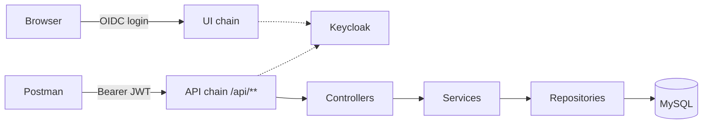

# 📚 Library_System

A library management system built as a semester project, it provides a REST API and a
simple web UI for managing authors and books, secured with Keycloak.

## ✨ Features

- CRUD for authors and books (Spring Data JPA, MapStruct, validation)
- Database schema managed by **Liquibase** migrations
- Web UI for all CRUD operations
- Two authentication flows: **OIDC login** for the UI and **JWT** for API clients
- Role-based access control via `SecurityFilterChain` and `@PreAuthorize`
- MySQL and Keycloak start automatically with Docker Compose

## Architecture

## 🔐 Access Rules

| Operation | USER | ADMIN | Enforced by |
|---|:---:|:---:|---|
| Read (`GET`) | ✅ | ✅ | SecurityFilterChain |
| Delete (`DELETE`) | ❌ | ✅ | SecurityFilterChain |
| Create / Update (`POST`, `PUT`) | ❌ | ✅ | `@PreAuthorize` |
| No valid token | ❌ 401 | ❌ 401 | OAuth2 Resource Server |

## 🚀 Getting Started

**Requirements:** JDK 21, Docker Desktop.

Run `LibrarySystemApplication` from IntelliJ IDEA (or `./mvnw spring-boot:run`).
MySQL and Keycloak start automatically; the Keycloak realm is imported from
`keycloak/course-realm.json`.

| Service | URL |
|---|---|
| Web UI | http://localhost:8081 |
| REST API | http://localhost:8081/api |
| Keycloak admin | http://localhost:8080 (`admin` / `admin`) |

| User | Password   | Roles |
|---|------------|---|
| `alice` | `alice***` | USER, ADMIN |
| `bob` | `bob123`   | USER |

## API

| Resource | Endpoints |
|---|---|
| Authors | `GET` `POST` `/api/authors`, `GET` `PUT` `DELETE` `/api/authors/{id}` |
| Books | `GET` `POST` `/api/books`, `GET` `PUT` `DELETE` `/api/books/{id}` |

All endpoints require `Authorization: Bearer <token>`.

## Postman

Import `postman/Library-API.postman_collection.json`, run the **Auth** folder to get
tokens, then run any request or the whole collection via **Run collection**.
Every request includes an automated status check.

## Roadmap

- [x] CRUD, Liquibase, OIDC + JWT security
- [ ] Book loans and return deadlines
- [ ] Notifications and statistics
- [ ] Multi-module Maven structure

## 👤 Author

**Kateryna Doroftei**