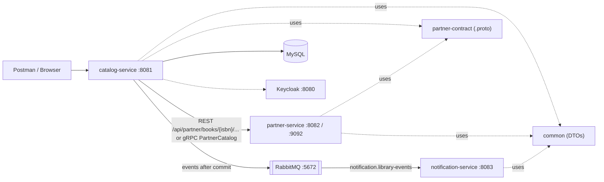
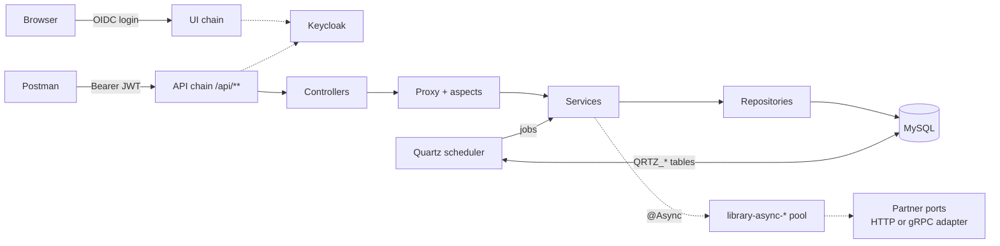
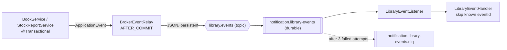
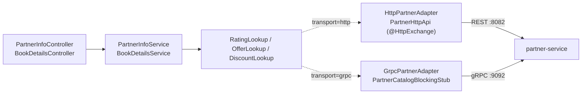

# 📚 Library System


A library management system built as a semester project for the
**Development of High-Load Corporate Systems** course. It provides a REST API and a
simple web UI for managing authors and books, secured with Keycloak.

## Features

- CRUD for authors and books (Spring Data JPA, MapStruct, validation)
- Database schema managed by **Liquibase** migrations
- Web UI for all CRUD operations
- Two authentication flows: **OIDC login** for the UI and **JWT** for API clients
- Role-based access control via `SecurityFilterChain` and `@PreAuthorize`
- Custom annotations: validation constraint, composed annotation, argument resolver
- Aspects: feature toggles, audit trail, input normalization
- Asynchronous processing in a bounded thread pool with timeouts, fallbacks and overload handling
- Scheduled jobs with **Quartz**: the schedule is stored in MySQL and survives restarts
- Unit and integration tests with a JaCoCo coverage gate (min. 60%)
- MySQL and Keycloak start automatically with Docker Compose
- **Multi-module Maven** build: three independent services and a shared `common` module
- The catalog talks to `partner-service` through **ports and adapters**: a declarative HTTP client (`@HttpExchange`) or **gRPC**, selected by configuration; each service has its own `Dockerfile`
- Explicit HTTP timeouts and per-call gRPC deadlines; partner errors are translated into `404` / `503`
- Domain events go through **RabbitMQ**: published after commit, consumed idempotently, nothing lost while the consumer is down

## Services

The repository is a multi-module Maven build. One `./mvnw clean verify` in the root builds and
tests every module. Each service is a standalone Spring Boot application with its own `main`
class, `application.yml`, port, tests and `Dockerfile`.

| Module | Port | Responsibility | Depends on |
|---|---|---|---|
| `catalog-service` | 8081 | Books, authors, security, UI, aspects, async, Quartz, partner adapters | `common`, `partner-contract` |
| `partner-service` | 8082 (REST), 9092 (gRPC) | Partner catalog by ISBN: ratings, offers and discounts | `common`, `partner-contract` |
| `notification-service` | 8083 | Consumes library events from RabbitMQ and sends email notifications | `common` |
| `common` | — | Shared DTOs and events only: `BookRating`, `StoreOffer`, `BookDiscount`, `NotificationRequest`, `BookCreatedEvent`, `BookDeletedEvent`, `StockReportGeneratedEvent` | — |
| `partner-contract` | — | `partner_catalog.proto` and the gRPC classes generated from it during the build | — |


```mermaid
flowchart LR
    Client["Postman / Browser"] --> CAT["catalog-service :8081"]
    CAT -->|"REST /api/partner/books/{isbn}/... or gRPC PartnerCatalog"| PAR["partner-service :8082 / :9092"]
    CAT -->|"events after commit"| MQ[["RabbitMQ :5672"]]
    MQ -->|"notification.library-events"| NOT["notification-service :8083"]
    CAT --> DB[("MySQL")]
    CAT -.-> KC["Keycloak :8080"]
    CAT -. uses .-> COM["common (DTOs)"]
    PAR -. uses .-> COM
    NOT -. uses .-> COM
    CAT -. uses .-> CON["partner-contract (.proto)"]
    PAR -. uses .-> CON
```

**Root POM** (`library-system-parent`, `packaging pom`):

| Section | Contents | Effect |
|---|---|---|
| `<modules>` | `common`, `catalog-service`, `partner-service`, `notification-service`, `partner-contract` | One build for the whole repository |
| `<dependencies>` | `spring-boot-starter-test`, Lombok | Inherited by every module, not declared in modules |
| `<dependencyManagement>` | versions of `common`, `partner-contract`, MapStruct and the gRPC BOM | Modules declare these dependencies without versions |
| `<pluginManagement>` | `spring-boot-maven-plugin` configuration | Enabled only in the POM of each service, not in `common` |
| `<build><plugins>` | compiler (Lombok processor), JaCoCo with a 60% gate | Applied to every module |

**Service independence.** No service depends on another service in Maven; they share only
`common` and the API module `partner-contract`. `./mvnw dependency:tree` confirms this:

```
com.example:catalog-service:jar:0.0.1-SNAPSHOT
+- com.example:common:jar:0.0.1-SNAPSHOT:compile
+- com.example:partner-contract:jar:0.0.1-SNAPSHOT:compile
com.example:partner-service:jar:0.0.1-SNAPSHOT
+- com.example:common:jar:0.0.1-SNAPSHOT:compile
+- com.example:partner-contract:jar:0.0.1-SNAPSHOT:compile
com.example:notification-service:jar:0.0.1-SNAPSHOT
+- com.example:common:jar:0.0.1-SNAPSHOT:compile
```

The catalog only knows the partner addresses (`library.partner.http.base-url`,
`library.partner.grpc.target`) and the broker address. Timeouts, deadlines and fallbacks protect it
from network failures: if `partner-service` is down, book details still return `200` with
`available: false`, and partner-only actions return `503`. The catalog does not call
`notification-service` at all: it publishes events to RabbitMQ, so the consumer can be stopped
without losing anything.

## Catalog Architecture


```mermaid
flowchart LR
    Browser["Browser"] -->|"OIDC login"| UI["UI chain"]
    Client["Postman"] -->|"Bearer JWT"| API["API chain /api/**"]
    UI -.-> KC["Keycloak"]
    API -.-> KC
    API --> C["Controllers"] --> P["Proxy + aspects"] --> S["Services"] --> R["Repositories"] --> DB[("MySQL")]
    S -.->|"@Async"| POOL["library-async-* pool"]
    POOL -.-> PORTS["Partner ports<br/>HTTP or gRPC adapter"]
    Q["Quartz scheduler"] -->|"jobs"| S
    Q <-->|"QRTZ_* tables"| DB
```

## Access Rules

| Operation | USER | ADMIN | Enforced by |
|---|:---:|:---:|---|
| Read (`GET`) | ✅ | ✅ | SecurityFilterChain |
| Delete (`DELETE`) | ❌ | ✅ | SecurityFilterChain |
| Create / Update / Copy (`POST`, `PUT`) | ❌ | ✅ | `@PreAuthorize` |
| Audit log, stock reports | ❌ | ✅ | `@PreAuthorize` |
| No valid token | ❌ 401 | ❌ 401 | OAuth2 Resource Server |

## Custom Annotations

| Annotation | Mechanism | What it does |
|---|---|---|
| `@ValidBookCopies` | Bean Validation constraint (class-level) | A book without ISBN is a unique item, so it can have at most one copy |
| `@PostCreated` | Composed annotation | Combines `@PostMapping` and `@ResponseStatus(HttpStatus.CREATED)` |
| `@CurrentUser` | MVC argument resolver | Injects the authenticated user into controller parameters |

## Aspects (AOP)

| Annotation | Advice | Concern | Observable effect |
|---|---|---|---|
| `@FeatureToggle("book-deletion")` | `@Around` | Disable an operation via configuration | `503`, the method is not executed |
| `@Audited(action = "BOOK_CREATED")` | `@AfterReturning` | Audit trail of successful operations | Entry in `GET /api/audit` |
| `@NormalizeInput` | `@Before` | Trim and collapse whitespace | `"  Kobzar  "` is stored as `"Kobzar"` |

**Self-invocation demo.** `BookService.copy(id)` calls `this.create(...)`, bypassing the proxy,
so the aspects on `create` are silently skipped — see `SelfInvocationTest`.

## ⚡ Asynchronous Processing

| Operation | Style | Where |
|---|---|---|
| Email notification about a new book | Fire-and-forget (`@Async void`) | `BookService.create` |
| Rating from an external reviews service | `@Async` → `CompletableFuture` | `GET /api/books/{id}/details` |
| Price from a partner bookstore | `@Async` → `CompletableFuture` | `GET /api/books/{id}/details` |

Bounded `ThreadPoolTaskExecutor` (core 2, max 4, queue 10, prefix `library-async-`).
Parallel calls are combined with `thenCombine`; failures and 2 s timeouts fall back to
`available: false`; a full pool returns `503` with `Retry-After` for book details and skips
notifications with a `WARN` log.

## Scheduled Jobs (Quartz)

The schedule is stored in MySQL (JDBC job store). The `QRTZ_*` tables are created by a
Liquibase changeset; Spring Boot does not create them (`initialize-schema: never`).

| Job | Trigger | Schedule (Europe/Kyiv) | Parameters | Misfire |
|---|---|---|---|---|
| `catalog-normalization` | `catalog-normalization-nightly` | daily at 03:00 | `batchSize=100` | do nothing |
| `stock-report` | `stock-report-daily` | daily at 08:00 | defaults: `daily`, threshold `1`, `maxTitles=20` | fire once now |
| `stock-report` | `stock-report-weekly` | Mondays at 09:00 | overrides: `weekly`, threshold `3` | do nothing |

- **Catalog normalization** cleans titles and names stored without normalization
  (e.g. copies created via self-invocation) — the same rules as `@NormalizeInput`.
- **Stock report** lists books with few copies left; one report per name and date
  (`GET /api/reports/stock`, admin only).

**Reliability**

| Concern | Solution |
|---|---|
| Jobs are thin | Each job reads its `JobDataMap` and makes one call to a `@Transactional` service |
| Idempotency | Normalization only touches dirty records; reports are upserted by name and date (unique key) |
| Concurrent runs | `@DisallowConcurrentExecution` on both jobs |
| Failures | Logged at ERROR, no immediate refire, the trigger stays scheduled — the next run retries |
| Wrong parameters | Missing or malformed keys fail with an explicit message; unknown trigger keys are ignored |
| Time zone | All cron triggers use `Europe/Kyiv` explicitly |
| Redeployments | `overwrite-existing-jobs: false` + `QuartzScheduleSynchronizer`: triggers are rescheduled only when their definition changed, so stored state and misfires survive restarts |

```yaml
library:
  scheduling:
    time-zone-id: Europe/Kyiv
    catalog-normalization-cron: "0 0 3 * * ?"
    daily-stock-report-cron: "0 0 8 * * ?"
    weekly-stock-report-cron: "0 0 9 ? * MON"
```

## Message Broker (RabbitMQ)

`catalog-service` (producer) and `notification-service` (consumer) exchange domain events through
RabbitMQ, described in `compose.yaml`. The services share only the event records from `common`.

| Business action | Event | Routing key | Result in `notification-service` |
|---|---|---|---|
| A book is created | `BookCreatedEvent` | `book.created` | Letter to readers, entry in `GET /api/notifications` |
| A book is deleted | `BookDeletedEvent` | `book.deleted` | Letter to readers, entry in `GET /api/notifications` |
| The Quartz job generates a stock report | `StockReportGeneratedEvent` | `stock-report.generated` | Letter to the administrator, entry in `GET /api/notifications` |


```mermaid
flowchart LR
    S["BookService / StockReportService<br/>@Transactional"] -->|"ApplicationEvent"| R["BrokerEventRelay<br/>AFTER_COMMIT"]
    R -->|"JSON, persistent"| X{{"library.events (topic)"}}
    X --> Q[["notification.library-events (durable)"]]
    Q --> L["LibraryEventListener"] --> H["LibraryEventHandler<br/>skip known eventId"]
    Q -.->|"after 3 failed attempts"| DLQ[["notification.library-events.dlq"]]
```

| Concern | Solution |
|---|---|
| One action, one event | Each business method publishes exactly one event with a new `eventId` |
| Only after commit | `@TransactionalEventListener(phase = AFTER_COMMIT)`; a rolled back action publishes nothing |
| No HTTP between the services | The catalog has no URL of `notification-service`; the consumer does not depend on catalog classes |
| Consumer is down | Durable exchange and queue, persistent messages, ack after successful processing: messages wait in the queue |
| Duplicate delivery | The consumer remembers processed `eventId`s and skips repeats |
| Broken messages | 3 attempts with backoff, then the message goes to the dead-letter queue instead of looping |
| Broker address | `${RABBITMQ_HOST:localhost}`: `rabbitmq` in Docker Compose, `localhost` from the IDE |

RabbitMQ management UI: http://localhost:15672 (`library` / `library_pass`).

## Interservice Communication (HTTP and gRPC)

The catalog asks `partner-service` about books by **ISBN** through three small ports. Services and
controllers depend only on the ports; the transport lives in adapters and is chosen by configuration.

| Port | Question | Used by |
|---|---|---|
| `RatingLookup` | What is the partner rating of this book? | Book details, partner rating |
| `OfferLookup` | What is the partner price and stock? | Book details, purchase quote |
| `DiscountLookup` | What discount does the partner give? | Purchase quote |


```mermaid
flowchart LR
    C["PartnerInfoController<br/>BookDetailsController"] --> S["PartnerInfoService<br/>BookDetailsService"]
    S --> P["RatingLookup / OfferLookup / DiscountLookup"]
    P -.->|"transport=http"| H["HttpPartnerAdapter<br/>PartnerHttpApi (@HttpExchange)"]
    P -.->|"transport=grpc"| G["GrpcPartnerAdapter<br/>PartnerCatalogBlockingStub"]
    H -->|"REST :8082"| PAR["partner-service"]
    G -->|"gRPC :9092"| PAR
```

| Business action | Catalog endpoint | When the partner fails |
|---|---|---|
| Book details | `GET /api/books/{id}/details` | `200` with `available: false` |
| Purchase quote (price after partner discount) | `GET /api/books/{id}/purchase-quote` | `404` / `503` |
| Partner rating | `GET /api/books/{id}/partner-rating` | `404` / `503` |

| Setting | Environment variable | Default |
|---|---|---|
| `library.partner.transport` (`http` or `grpc`) | `PARTNER_TRANSPORT` | `http` |
| `library.partner.http.base-url` | `PARTNER_HTTP_URL` | `http://localhost:8082` |
| `library.partner.http.connect-timeout` / `read-timeout` | `PARTNER_HTTP_CONNECT_TIMEOUT` / `PARTNER_HTTP_READ_TIMEOUT` | `1s` / `2s` |
| `library.partner.grpc.target` | `PARTNER_GRPC_TARGET` | `localhost:9092` |
| `library.partner.grpc.deadline` (set on every call) | `PARTNER_GRPC_DEADLINE` | `2s` |
| `partner.grpc.enabled` in `partner-service` | `PARTNER_GRPC_ENABLED` | `false` (`true` in Docker Compose) |

An unknown transport, a missing address or a zero timeout stops the catalog at startup.
Exactly one adapter bean is created.

| What happened | REST adapter sees | gRPC adapter sees | Catalog returns |
|---|---|---|---|
| The partner does not know the ISBN | `404` | `NOT_FOUND` | `404` (`PartnerDataNotFoundException`) |
| The partner is down | connection refused | `UNAVAILABLE` | `503` (`PartnerUnavailableException`) |
| The partner is too slow | read timeout (2 s) | `DEADLINE_EXCEEDED` (2 s) | `503` |
| Any other error | any other status | any other status | `503` |

`RestClientException` and `StatusRuntimeException` never leave the adapters.

The gRPC contract is `partner-contract/src/main/proto/partner_catalog.proto`
(service `library.partner.v1.PartnerCatalog`: `GetRating`, `GetOffer`, `GetDiscount`).

## Getting Started

**Requirements:** JDK 21, Docker Desktop.

**Option 1: everything from IntelliJ IDEA.** Run `PartnerServiceApplication`,
`NotificationServiceApplication` and `LibrarySystemApplication` (working directory
`$MODULE_WORKING_DIR$`). MySQL, Keycloak and RabbitMQ start automatically with the catalog; the Keycloak
realm is imported from `keycloak/course-realm.json`.

To start the partner gRPC server from the IDE, set `PARTNER_GRPC_ENABLED=true` for
`PartnerServiceApplication`. To switch the catalog to gRPC, set `PARTNER_TRANSPORT=grpc` for
`LibrarySystemApplication`.

**Option 2: partner and notification services in Docker.**

```bash
./mvnw clean package -DskipTests
docker compose --profile services up -d --build
```

Then run only `LibrarySystemApplication` from IntelliJ IDEA. Stop the containers with
`docker compose --profile services stop`. The catalog image can be built with
`docker build -t library/catalog-service:0.0.1-SNAPSHOT catalog-service`.

| Service | URL |
|---|---|
| Web UI | http://localhost:8081 |
| REST API | http://localhost:8081/api |
| Partner service | http://localhost:8082/api/partner |
| Partner gRPC | `localhost:9092` (`library.partner.v1.PartnerCatalog`) |
| Notification service | http://localhost:8083/api/notifications |
| Keycloak admin | http://localhost:8080 (`admin` / `admin`) |
| RabbitMQ UI | http://localhost:15672 (`library` / `library_pass`) |

| User | Password | Roles |
|---|---|---|
| `alice` | `alice123` | USER, ADMIN |
| `bob` | `bob123` | USER |

## API

| Resource | Endpoints |
|---|---|
| Authors | `GET` `POST` `/api/authors`, `GET` `PUT` `DELETE` `/api/authors/{id}` |
| Books | `GET` `POST` `/api/books`, `GET` `PUT` `DELETE` `/api/books/{id}`, `POST` `/api/books/{id}/copy` |
| Book details | `GET` `/api/books/{id}/details` — book + external rating + bookstore offer |
| Partner data | `GET` `/api/books/{id}/partner-rating`, `GET` `/api/books/{id}/purchase-quote` — `404` if the partner does not know the ISBN, `503` if it is unavailable |
| Current user | `GET` `/api/me` |
| Audit log | `GET` `/api/audit` (ADMIN only) |
| Stock reports | `GET` `/api/reports/stock` (ADMIN only) |

All catalog endpoints require `Authorization: Bearer <token>`.

Internal service APIs (no authentication, called by the catalog):

| Service | Endpoints |
|---|---|
| `partner-service` | REST `GET` `/api/partner/books/{isbn}/rating`, `/offer`, `/discount` (`404` unknown ISBN, `503` unavailable); gRPC `GetRating`, `GetOffer`, `GetDiscount` on port 9092 (`NOT_FOUND`, `UNAVAILABLE`) |
| `notification-service` | `GET` `/api/notifications` (events processed from the broker) |

## Testing

Tests are built with **JUnit 5**, **Mockito**, **AssertJ** and **Awaitility**. Unit tests run
without a database or Spring context; async behavior is verified in minimal Spring contexts;
idempotency of scheduled jobs is verified by integration tests on an in-memory **H2** database
with the real Liquibase schema; Quartz behavior is verified on a real in-memory scheduler.

```bash
./mvnw clean verify
```

JaCoCo reports are generated per module at `<module>/target/site/jacoco/index.html`.
The build fails if line or instruction coverage of any module drops below **60%**.

| Area | Test classes |
|---|---|
| Services | `AuthorServiceTest`, `BookServiceTest`, `BookDetailsServiceTest` |
| Security | `KeycloakJwtAuthenticationConverterTest` |
| Custom annotations | `ValidBookCopiesTest`, `PostCreatedTest`, `CreateEndpointsTest`, `CurrentUserArgumentResolverTest`, `CurrentUserControllerTest`, `WebConfigTest` |
| Aspects | `FeatureToggleAspectTest`, `FeaturePropertiesTest`, `FeatureToggleProxyTest`, `AuditAspectTest`, `AuditTrailTest`, `AuditProxyTest`, `AuditControllerTest`, `NormalizeInputAspectTest`, `DtoNormalizationTest`, `NormalizeInputProxyTest`, `SelfInvocationTest` |
| Async | `AsyncConfigTest`, `AsyncExecutorThreadTest`, `LoggingAsyncExceptionHandlerTest`, `ParallelCallsTest`, `BookDetailsControllerTest`, `ExecutorRejectionTest`, `OverloadHandlingTest` |
| Partner ports and adapters | `HttpPartnerAdapterTest`, `GrpcPartnerAdapterTest`, `HttpClientsConfigTest`, `PartnerTransportConfigTest`, `PartnerInfoServiceTest`, `PartnerInfoControllerTest` |
| Messaging (catalog) | `MessagingConfigTest`, `LibraryEventPublisherTest`, `BrokerEventRelayTest`, `AfterCommitPublicationTest`, `BrokerAddressTest` |
| Messaging (consumer) | `MessagingConfigTest`, `LibraryEventHandlerTest`, `LibraryEventListenerTest`, `BrokerSettingsTest` |
| Partner service | `PartnerCatalogTest`, `ReviewsServiceTest`, `BookstoreServiceTest`, `PartnerControllerTest`, `PartnerGrpcServiceTest`, `GrpcServerLifecycleTest`, `GrpcServerConfigTest` |
| Partner contract | `PartnerContractTest` |
| Notification service | `EmailServiceTest`, `NotificationControllerTest` |
| Common | `CommonDtoTest`, `LibraryEventsTest` |
| Scheduling | `QuartzSchemaConfigurationTest`, `QuartzJobsConfigTest`, `QuartzScheduleSynchronizerTest`, `QuartzExecutionBehaviourTest`, `JobParametersTest`, `CatalogNormalizationJobTest`, `StockReportJobTest`, `CatalogNormalizationServiceTest`, `CatalogNormalizationServiceIntegrationTest`, `StockReportServiceTest`, `StockReportServiceIntegrationTest`, `StockReportControllerTest` |

## Postman

Import `postman/Library API.postman_collection.json`, run the **Auth** folder to get
tokens, then run any request or the whole collection via **Run collection**.
The **Lab 7 - Services** folder calls `partner-service` directly; **Lab 8 - Message broker**
creates and deletes a book and checks that `notification-service` processed both events, and that
a failed action publishes nothing. **Lab 9 - Interservice** checks the purchase quote, the partner
rating, book details and `404` for an unknown ISBN; it passes unchanged with `PARTNER_TRANSPORT=http`
and `PARTNER_TRANSPORT=grpc`. Its last four requests are manual: they need the partner stopped or
started with `PARTNER_BOOKSTORE_DELAY=3s` and expect `503`.

gRPC calls are kept in a separate Postman collection **Library gRPC** (server `localhost:9092`
without TLS, service definition imported from `partner_catalog.proto`), because Postman does not
export gRPC requests to JSON.

## Project Structure

```
library-repo/
├── pom.xml                 # root POM: modules, shared dependencies and plugins
├── compose.yaml            # MySQL, Keycloak, RabbitMQ, partner (REST + gRPC) and notification services
├── common/                 # shared DTOs (records only, no Spring)
├── catalog-service/        # main application, port 8081
│   ├── Dockerfile
│   └── src/main/java/com/example/library_system/
│       ├── aop/            # aspects and their annotations
│       ├── audit/          # audit log storage
│       ├── config/         # security, web, async, clock, partner HTTP client and transport selection
│       ├── controller/     # REST controllers and overload handler
│       ├── dto/            # request/response objects
│       ├── entity/         # JPA entities
│       ├── external/       # async client for book details
│       ├── mapper/         # MapStruct mappers
│       ├── messaging/      # domain events published to RabbitMQ after commit
│       ├── partner/        # ports, HTTP and gRPC adapters, partner exceptions
│       ├── repository/     # Spring Data JPA repositories
│       ├── scheduling/     # Quartz jobs, triggers and schedule synchronization
│       ├── service/        # business logic
│       ├── validation/     # custom Bean Validation constraint
│       └── web/            # composed annotation and argument resolver
├── partner-contract/       # partner_catalog.proto; gRPC classes are generated during the build
├── partner-service/        # partner catalog by ISBN over REST (8082) and gRPC (9092)
│   └── Dockerfile
└── notification-service/   # consumes events from RabbitMQ, port 8083
    └── Dockerfile
```

## Roadmap

- [x] CRUD, Liquibase, OIDC + JWT security
- [x] Unit tests with 60%+ coverage
- [x] Custom annotations: constraint, composed annotation, argument resolver
- [x] AOP: feature toggles, audit trail, input normalization
- [x] Async processing: bounded executor, parallel calls, timeouts, overload handling
- [x] Scheduled jobs with Quartz: persistent schedule, idempotent jobs, misfire handling
- [x] Multi-module Maven structure: separate services, shared `common`, Dockerfiles
- [x] Message broker: domain events through RabbitMQ, idempotent consumer, dead-letter queue
- [x] Interservice communication: ports and adapters, declarative HTTP client, gRPC with deadlines, transport selection
- [ ] Book loans and return reminders

## 👤 Author

**Kateryna Doroftei**